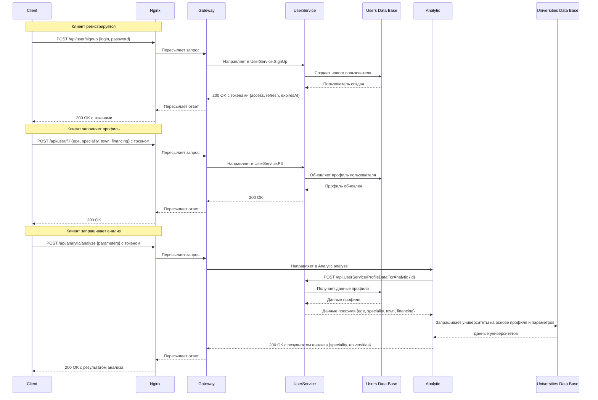

# 🎓 University Selection Service

**University Selection Service** — микросервисное веб-приложение для подбора университетов по критериям будущих абитуриентов

---
## 📦 Стек технологий
- Golang
- gRPC + grpc-gateway
- PostgreSQL
- Docker + Docker Compose
- Zap logger
- pgx / SQL миграции
- Nginx balancer
---

## 🚀 Быстрый старт

### Требования

- Установленный **Docker**
- Установленный механизм **migrate**
- Установленный **Make**

### Шаги запуска

1. Клонируй репозиторий

```bash
$ git clone https://github.com/Winushkin/University-Selection-Service.git
$ cd University-Selection-Service
```

2. Настрой переменные окружения

```bash
$ cp .env.example .env
```

3. Запусти проект
```bash
$ make build
```

## 🧱 Структура проекта
````

University-Selection-Service/
├── .github/
│   └── workflows/
│       └── ci.yaml
├── Makefile
├── README.md
├── example.xlsx
├── result2022.xlsx
├── backend/
│   ├── api/
│   │   ├── analytic.proto
│   │   └── user.proto
│   ├── cmd/
│   │   ├── analytic/
│   │   │   ├── Dockerfile
│   │   │   └── main.go
│   │   ├── gateway/
│   │   │   ├── Dockerfile
│   │   │   └── main.go
│   │   ├── nginx/
│   │   │   ├── Dockerfile
│   │   │   └── nginx.conf
│   │   ├── university/
│   │   │   └── main.go
│   │   └── user/
│   │       ├── Dockerfile
│   │       └── main.go
│   ├── database_data/
│   │   ├── universities_data/
│   │   └── users_data/
│   ├── db/
│   │   └── migrations/
│   │       ├── universities/
│   │       │   ├── 000001_create_universities_schema.down.sql
│   │       │   ├── 000001_create_universities_schema.up.sql
│   │       │   ├── 000002_create_regions_table.down.sql
│   │       │   ├── 000002_create_regions_table.up.sql
│   │       │   ├── 000003_create_universities_table.down.sql
│   │       │   ├── 000003_create_universities_table.up.sql
│   │       │   ├── 000004_create_specialities_table.down.sql
│   │       │   └── 000004_create_specialities_table.up.sql
│   │       └── users/
│   │           ├── 000001_initialize_users_schema.down.sql
│   │           ├── 000001_initialize_users_schema.up.sql
│   │           ├── 000002_add_table_users.down.sql
│   │           ├── 000002_add_table_users.up.sql
│   │           ├── 000003_add_table_refresh_tokens.down.sql
│   │           └── 000003_add_table_refresh_tokens.up.sql
│   ├── docker/
│   │   └── docker-compose.yml
│   ├── env/
│   │   ├── analytic.env
│   │   ├── analytic_env.example
│   │   ├── universities.env
│   │   ├── universities_env.example
│   │   ├── user.env
│   │   ├── user_env.example
│   │   ├── users_postgres.env
│   │   └── users_postgres_env.example
│   ├── internal/
│   │   ├── analytic/
│   │   │   ├── analyze.go
│   │   │   └── analyze_test.go
│   │   ├── server/
│   │   │   ├── server.go
│   │   │   └── server_test.go
│   │   ├── config/
│   │   ├── entities/
│   │   ├── interceptors/
│   │   ├── parser/
│   │   ├── repositories/
│   │   ├── university/
│   │   ├── user/
│   │   ├── api/
│   │   ├── logger/
│   │   ├── postgres/
│   │   ├── resilience/
│   │   └── security/
│   └── third_party/
│       └── googleapis/
│           └── google/
│               └── api/
│                   ├── annotations.proto
│                   ├── empty.proto
│                   ├── http.proto
│                   ├── openapi.proto
│                   └── openapiv2.proto
└── frontend/
    ├── node_modules/
    ├── public/
    │   └── vite.svg
    ├── eslint.config.js
    ├── index.html
    ├── package.json
    ├── package-lock.json
    ├── vite.config.js
    └── src/
        ├── assets/
        │   └── react.svg
        ├── components/
        │   ├── ToggleSwitch.jsx
        │   └── ToggleSwitch.css
        ├── pages/
        │   ├── Home.jsx
        │   ├── Home.module.css
        │   ├── RegistrationForm.jsx
        │   ├── RegistrationForm.css
        │   ├── LoginForm.jsx
        │   ├── ProfileForm.jsx
        │   ├── ProfileForm.css
        │   ├── EditProfileForm.jsx
        │   ├── MainPage.jsx
        │   ├── MainPage.module.css
        │   └── UniversityPage.jsx
        ├── App.jsx
        ├── AuthProvider.jsx
        ├── index.css
        └── main.jsx


````

## 📨 Описание работы приложения
Приложение **University Selection Service** состоит из двух масштабных частей - _клиентской_ и _серверной_, которые взаимодействуют друг с другом с помощью _HTTP_-запросов.

## 🌐 Описание клиентской части

## 💻 Описание серверной части
**Серверная часть** приложения состоит из нескольких микросервисов на языке _Go_ и баз данных _PostgreSQL_. Серверная часть обрабатывает HTTP-запросы от клиентской части, и распределяет и по соответсвующим микросервисам, которые, взаимодействуя между собой и с базами данных, собирают ответ и передают его в руки клиентской части.

- Выбор **микросервисной** модели для серверной части приложения обусловлен важностью преимуществ данной модели в рамках разработки приложения. Изоляция отдельных компонентов позволила вносить изменения безболезенно для остальных комнонетов, а также обеспечила гибкость и свободу выбора технологий. Также посредством данной модели была обеспечена масштабируемость серверной части.
- Выбор языка _Go_ обусловлен его высокой производительностью и скоростью разработки на нем, также поддержка gRPC в языке обеспечила высокую скорость обмена данных между сервисами.
- Выбор СУБД _PostgreSQL_ обусловлен ее открытостью, надежностью и кроссплатформенностью, а также поддержкой сложных запросов и больших объемов данных.

Серверная часть состоит из: 

Микросервисов:
1. User - производит аутентификацию и авторизацию пользователей в системе, а также отвечает за управление профилями пользователей
2. Analytic - анализирует данные пользователя и на их основе подбирает наиболее подходящие университеты с помощью "Метода анализа иерархий" из собранных в базе данных.
3. Universities - собирает данные о ВУЗах в открытых интернет-источниках и собирает их в базу данных.
4. Gateway - производит маршрутизацию HTTP-запросов на gRPC-серверы.

Баз данных:
1. База данных университетов
2. База данных пользователей

### Сервис User
Сервис **User** содержит:

- _gRPC-сервер_ для взаимодействия с клиентом и другими сервисами  - `backend/internal/user/server.go`
- _Репозиторий_ для взаимодействия с базой данных пользователей - `backend/internal/repositories/user_repository.go`
- _Конфигурацию_ для настройки сервиса - `backend/internal/config/user_config.go`

Сервис **User** выставляет наружу для взаимодействия с клиентом следующие endpoint-ы:
1. /api/user/signup - производится регистрация пользователя в системе и создание профиля в базе данных пользователей.
2. /api/user/login - производится авторизация пользователя в системе и выдача прав на взаимодействие с остальным функционалом системы.
3. /api/user/refresh - обновление access-токена для авторизации запросов пользователя в системе.
4. /api/user/fill - обновление данных профиля в базе данных.
5. /api/user/logout - выход пользователя из системы и отзыв прав на взаимодействие с системой.

Для взаимодействия с сервисом **Analytic** выделен endpoint:
1. /api.UserService/ProfileDataForAnalytic - предоставляет данные профиля сервису **Analytic**.

### Сервис Analytic
Сервис **Analytic** содержит:

- _gRPC-сервер_ для взаимодействия с клиентом и другими сервисами - `backend/internal/analytic/server/server.go`
- _Репозиторий_ для взаимодействия с базой данных университетов - `backend/internal/repositories/analytic_repository.go`
- _Конфигурацию_ для настройки сервиса - backend/internal/config/analytic_config.go
- _Анализатор_ для выполнения `Метода анализа иерархий` с заданными параметрами - `backend/internal/analytic/analyze/analyze.go`

Сервис **Analytic** выставляет наружу для взаимодействия с клиентом следующий endpoint:
1. /api/analytic/analyze - выполняется `Метод анализа иерархий` с параметрами из запроса и данными профиля пользователя.

### Сервис University
Сервис **University** содержит:

- _Реализацию сервиса_, заполняющего данные об университетах - `backend/internal/university/service.go`
- _Конфигурацию_ для настройки сервиса - `backend/internal/config/university_config.go`
- _Репозиторий_ для заполнения базы данных университетов - `backend/internal/repositories/university_repository.go`
- _Парсер_ для выделения данных об университетах из источника - `backend/internal/parser/parser.go`

### Сервис Gateway
Сервис **Gateway** содержит:

- _Точку входа_ с реализацией _обратного прокси_ для маршрутизации HTTP-запросов клиента на gRPC-сервисы **User** и **Analytic** - `backend/cmd/gateway/main.go`

### База данных пользователей
Взаимодействие с базой реализует сервис **User**. Сама база данных поднимается в контейнере `users_postgres_service` описанном в `backend/docker/docker-compose.yml`. Настройка схемы базы данных производится с помощью миграций, описанных в `backend/db/migrations/users`
База данных пользователей хранит:

- Профили пользователей
```sql
     id SERIAL PRIMARY KEY,
     login TEXT UNIQUE NOT NULL,
     password TEXT,
     ege INT,
     speciality TEXT,
     region TEXT,
     financing TEXT
```
- Refresh-токены пользователей
```sql
    id SERIAL PRIMARY KEY,
    user_id INT,
    token TEXT UNIQUE NOT NULL,
    expires_at TIMESTAMP NOT NULL
```

### База данных университетов
Взаимодействие с базой данных реализуют сервисы **University** и **Analytic**. Сама база данных поднимается в контейнере `universities_postgres_service` описанном в `backend/docker/docker-compose.yml`. Настройка схемы базы данных производится с помощью миграций, описанных в `backend/db/migrations/universities`
База данных хранит:

- Имена регионов
```sql
    id SERIAL PRIMARY KEY,
    name TEXT NOT NULL UNIQUE
```
- Данные об университетах
```sql
    id SERIAL PRIMARY KEY,
    name TEXT NOT NULL UNIQUE,
    site TEXT,
    prestige INT NOT NULL UNIQUE,
    rank FLOAT NOT NULL,
    quality SMALLINT NOT NULL,
    scholarship INT,
    dormitory BOOLEAN,
    labs BOOLEAN,
    sport BOOLEAN,
    region_id INT REFERENCES universities.regions(id)
```
- Данные о специальностях
```sql
    id SERIAL PRIMARY KEY,
    university_id INT REFERENCES universities.universities(id),
    name TEXT NOT NULL,
    budget_points INT,
    contract_points INT,
    cost INT NOT NULL
```

### Nginx

В целях обеспечения масштабируемости системы и асинхронной обработки запросов было использован веб-сервер Nginx.

- Конфигурация веб-сервера описана в файле `backend/cmd/nginx/nginx.conf`
- Запуск контейнера `nginx_service` производится в файле `backend/docker/docker-compose.yml` с использованием образа из файла `backend/cmd/nginx/Dockerfile`

### Docker и Docker Compose

Для безопасного управления контейнерами и их развертыванием было использовано программное обеспечение Docker. 
- В Dockerfile собираются образы сервисов и баз данных
- В docker-compose.yml осуществляется управление контейнерами

### GitHub Actions

Для обеспечения разработки в окружении _CI/CD_-методологии был использован инструмент **GitHub Actions**.
В файле `.github/workflows/ci.yaml` описан CI-pipeline для автоматизации сборки и тестирования системы. Описанный CI-pipeline исполнялся инструментом **Github Actions**.

### Отказоустойчивость

Для повышения отказоустойчивости системы были реализованы и внедрены паттерны **Retry** и **Timeout**.

- **Retry** повторяет неудачную операцию несколько раз с увеличением времени ожидания (Exponential Backoff). Если все попытки исчерпаны, паттерн возвращает ошибку.
- **Timeout** прерывает выполнение операции, если она занимает слишком много времени.

---
## 📗 Паттерны микросервисной разработки

В ходе разработки системы были использованы следующие паттерны:

1. Паттерн «Экземпляр сервиса на контейнер» - позволяет изолировать экземпляры сервисов друга от друга, избежать конфликтов версий и требований к ресурсам, максимально использовать ресурсы хоста, а также легче и быстрее проводить повторные развертывания.
2. Паттерн «Распределенная трассировка» - назначает каждому внешнему запросу уникальный идентификатор (Request_Id), который будет передаваться всем сервисам, участвующим в обработке запроса, и фиксироваться в журналах.
3. Паттерн «Разбиение по поддоменам» - разбивает всю модель предметной области (домен) на поддомены. У каждого поддомена своя модель данных, область действия которой принято называть ограниченным контекстом (Bounded Context). Каждый микросервис будет разрабатываться внутри этого ограниченного контекста.
4. Паттерн «База данных на сервис» - предоставляет каждому сервису собственное хранилище данных, чтобы не было сильных зависимостей на уровне данных.
5. Паттерн «API-шлюз» - примененяет шлюз, который находится между клиентским приложением и микросервисами, обеспечивая единую точку входа для клиента.
6. Паттерн «Сборка пользовательского интерфейса на стороне клиента» - создание и обновление разметки HTML непосредственно в браузере. Каждый экран/страница пользовательского интерфейса разбивается на фрагменты, данные для которых получают различные микросервисы.
---

## 📊 Диаграмма sequence

## Диаграмма class
```mermaid

```